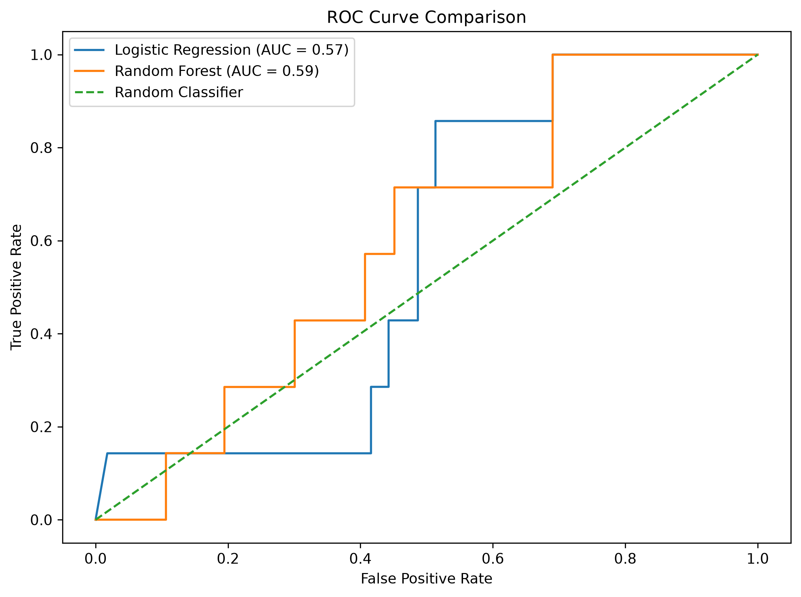
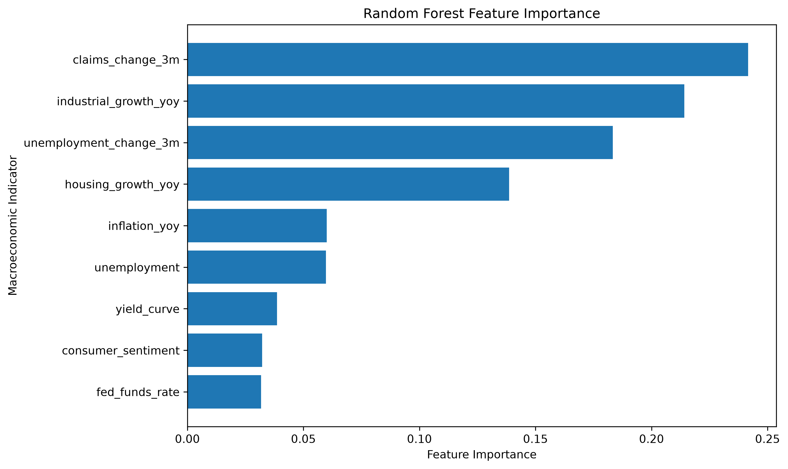
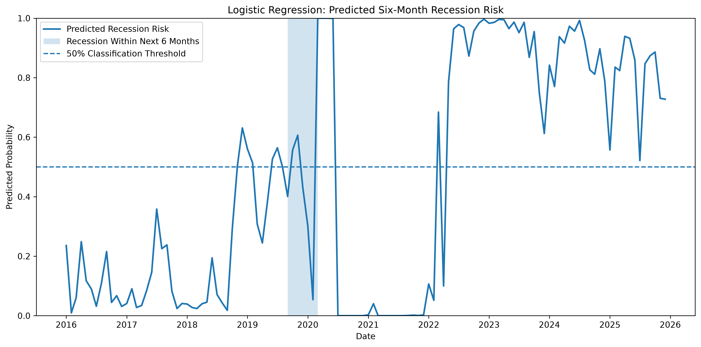

# U.S. Recession Predictor

A machine learning project that explores whether macroeconomic indicators can help predict U.S. recession risk six months in advance.

## Project Overview

Recessions are difficult to forecast because economic conditions evolve over time and recession periods are relatively rare. This project builds an end-to-end data science pipeline using U.S. macroeconomic data from the Federal Reserve Economic Data (FRED) database.

The project collects and cleans monthly economic data, engineers economically meaningful features, and compares Logistic Regression and Random Forest models for predicting whether the U.S. economy will enter a recession within the following six months.

Rather than focusing only on predictive accuracy, the project also examines model interpretability, class imbalance, false recession signals, and the limitations of applying historical economic relationships to future periods.

## Research Question

**Can macroeconomic indicators be used to predict whether the U.S. economy will enter a recession within the next six months?**

## Data

Macroeconomic data is collected from FRED using the FRED API.

Indicators include:

- Unemployment rate
- Treasury yield curve
- Federal funds rate
- Consumer Price Index (CPI)
- Industrial production
- Housing starts
- Initial unemployment claims
- Consumer sentiment
- NBER recession indicator

## Feature Engineering

Several features were constructed to capture changes in economic conditions rather than relying only on raw indicator levels.

Examples include:

- 3-month change in unemployment
- 3-month change in initial unemployment claims
- Year-over-year inflation
- Year-over-year industrial production growth
- Year-over-year housing growth
- Treasury yield spread

The target variable indicates whether a recession occurs within the following six months.

## Models

Two classification models are compared:

### Logistic Regression

Logistic regression provides an interpretable baseline and allows the direction and magnitude of relationships between standardized macroeconomic indicators and predicted recession risk to be examined.

### Random Forest

A Random Forest classifier is used to capture nonlinear relationships and interactions between macroeconomic indicators.

## Evaluation

Because recession periods are rare, the dataset is highly imbalanced. Accuracy alone can therefore be misleading.

Models are evaluated using:

- Precision
- Recall
- F1 score
- ROC-AUC
- Confusion matrices

A chronological train-test split is used instead of a random split to better reflect a real forecasting setting and reduce look-ahead bias.

## Results

The two models produced relatively modest predictive performance, highlighting the difficulty of forecasting recessions using a small number of macroeconomic indicators.

| Model | ROC-AUC |
|---|---:|
| Logistic Regression | 0.57 |
| Random Forest | 0.59 |

The Random Forest achieved a slightly higher ROC-AUC than Logistic Regression. However, both models showed limited ability to consistently distinguish recession periods from non-recession periods.

For the Random Forest model, the test-set results were:

- Accuracy: 0.725
- Precision: 0.067
- Recall: 0.286
- F1 Score: 0.108
- ROC-AUC: 0.594

The relatively high accuracy should be interpreted cautiously because recession observations are much less common than non-recession observations. Recall and F1 score provide a more informative picture of the model's ability to identify recession risk.

## Model Comparison



The ROC curves show that the Random Forest slightly outperformed Logistic Regression, although neither model achieved strong predictive separation on the test period.

## Random Forest Feature Importance



The Random Forest model identified changes in initial unemployment claims, industrial production growth, and changes in unemployment as some of the most important predictors.

This suggests that changes in labor-market conditions and real economic activity contain useful information about future recession risk.

## Recession Risk Over Time



The predicted probability series illustrates how estimated recession risk changes through time. The 50% threshold represents the model's classification cutoff, while the shaded regions indicate periods associated with recession risk in the target variable.

## Key Takeaways

The project demonstrates several challenges involved in recession forecasting:

1. Recessions are rare, creating substantial class imbalance.
2. High classification accuracy does not necessarily imply strong recession detection.
3. Macroeconomic indicators can contain predictive information, but their relationships with recessions are unstable over time.
4. Different models may identify similar signals while still producing relatively weak out-of-sample performance.
5. Economic forecasting requires careful attention to timing, data availability, and potential look-ahead bias.

## Project Structure

```text
recession-predictor/
├── data/
│   ├── raw/                  # Raw macroeconomic data from FRED
│   └── processed/            # Cleaned and model-ready datasets
├── figures/                  # Model evaluation and visualization outputs
├── notebooks/
│   ├── 01_data_exploration.ipynb
│   ├── 02_data_cleaning.ipynb
│   ├── 03_feature_engineering.ipynb
│   └── 04_modeling.ipynb
├── src/
│   └── fetch_fred.py         # Downloads data from the FRED API
├── .gitignore
├── README.md
└── requirements.txt
```

## How to Run the Project

### 1. Clone the repository

```bash
git clone https://github.com/ellied07/recession-predictor.git
cd recession-predictor
```

### 2. Create and activate a virtual environment

```bash
python3 -m venv .venv
source .venv/bin/activate
```

### 3. Install dependencies

```bash
pip install -r requirements.txt
```

### 4. Add a FRED API key

Create a `.env` file in the root directory:

```text
FRED_API_KEY=your_api_key_here
```

The `.env` file is excluded from Git so that the API key is not publicly exposed.

### 5. Download the data

```bash
python src/fetch_fred.py
```

### 6. Run the notebooks

Run the notebooks in order:

1. `01_data_exploration.ipynb`
2. `02_data_cleaning.ipynb`
3. `03_feature_engineering.ipynb`
4. `04_modeling.ipynb`

## Tools & Technologies

- Python
- pandas
- NumPy
- Matplotlib
- scikit-learn
- FRED API
- Jupyter Notebook
- Git/GitHub

## Limitations

This project is intended as an exploratory machine learning analysis rather than a production recession forecasting system. Recessions are rare events, and the relatively small number of recession observations limits model training and evaluation.

Macroeconomic data may also be revised after its initial publication. A fully real-time forecasting system would need to account for historical data vintages to ensure that each prediction uses only information that would actually have been available at the time.

Future improvements could include additional leading indicators, alternative prediction horizons, class-imbalance techniques, hyperparameter tuning, and real-time vintage data.